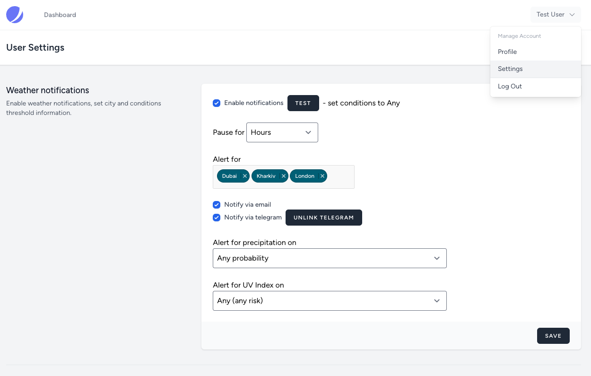

## Weather Notification Service

### Steps to Run the Service

1. **Clone the project**
   ```bash
   git clone https://github.com/kapver/weather-app.git
   ```

2. **Navigate to the project directory**
   ```bash
   cd weather-app
   ```

3. **Install dependencies and start the service**
   ```bash
   chmod +x ./install.sh && ./install.sh
   ```

4. **Preview the application**  
   Open your browser and navigate to:  
   [http://127.0.0.1:8001](http://127.0.0.1:8001)


5. **Update User Settings**  
   You can configure your preferred weather conditions and notification settings by navigating to:  
   [http://127.0.0.1:8001/user/settings](http://127.0.0.1:8001/user/settings)
   


6. **Check Emails Sent with Mailpit**  
   You can view any emails sent by the service by navigating to:  
   [http://localhost:8025/](http://localhost:8025/)


7. **Test User Account:**  
You can log in using the following credentials:

- **Email:** test@weather.io
- **Password:** 111

> **Note:** The host machine is assumed to lack PHP and Composer, so a workaround is implemented under the hood.

---

Tested on **macOS 15.3.1**